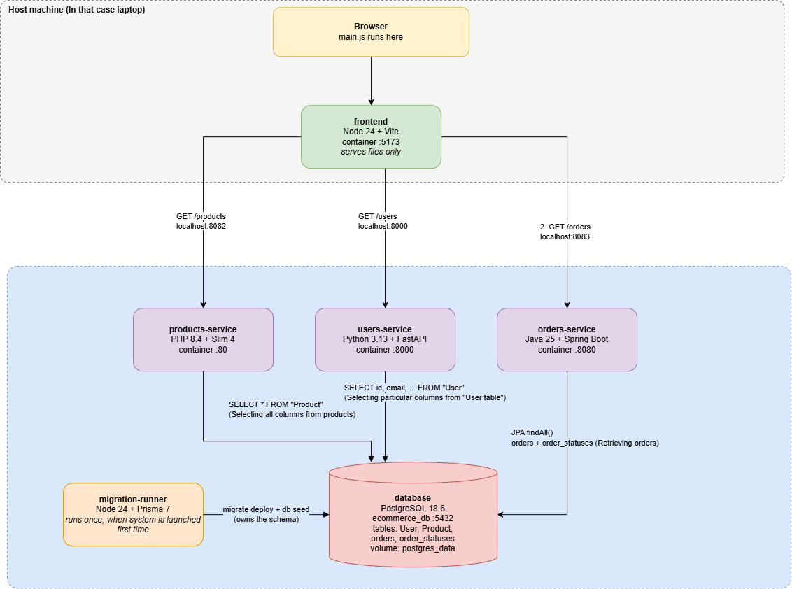

# Module 1 — System map

## a. The system, drawn from the code

The five parts are `frontend`, `products-service`, `users-service`,
`orders-service` and `postgres` (the `database` container, plus the one-shot
`migration-runner` that sets it up).

Diagram file: [01-system-map.drawio.png](01-system-map.drawio.png)

Arrows point from the side that opens the connection to the side that answers.

### What talks to what

Every connection in the running system, and its direction:

1. **Browser -> `frontend`** - `http://localhost:5173/`. Returns
   `index.html` and the JS modules (Vite dev server). Communication protocol: HTTP
2. **Browser -> `products-service`** - `http://localhost:8082/products`. Returns
   the list of products as JSON. Communication protocol: HTTP
3. **Browser -> `users-service`** - `http://localhost:8000/users`. Returns the
   list of users (without `password`) as JSON. Communication protocol: HTTP
4. **Browser -> `orders-service`** - `http://localhost:8083/orders`. Returns the
   list of orders, each with its status, as JSON. Communication protocol: HTTP
5. **`products-service` -> `database`** - `database:5432`. Runs
   `SELECT * FROM "Product"`. Communication protocol: PostgreSQL over TCP
6. **`users-service` -> `database`** - `database:5432`. Runs
   `SELECT id, email, name, role, ... FROM "User"`. Communication protocol: PostgreSQL over TCP
7. **`orders-service` -> `database`** - `jdbc:postgresql://database:5432`. Runs
   JPA `findAll()` on `orders` + `order_statuses`. Communication protocol: PostgreSQL over TCP
8. **`migration-runner` -> `database`** - `database:5432`. Creates/updates the
   tables, then upserts the seed rows. Communication protocol: PostgreSQL over TCP

Connections 2–4 all start **after** connection 1: the browser first downloads
`main.js` from `frontend`, and only that code, now running in the browser,
calls the three services (`frontend/src/main.js:54-58`). The browser reaches
the services on `localhost` because Docker publishes their ports to the host;
connections 5–8 stay inside the Compose network and use the service name
`database`.

What does **not** talk to anything:

- service -> service: never. `products-service`, `users-service` and
  `orders-service` do not know about each other. They share data only through
  the database (for example, `orders.userId` points at a `User` row, but
  `orders-service` never asks `users-service` about it).
- `database` -> anyone: never. Postgres only answers; it does not open
  connections.
- `migration-runner` is not called by anyone and has no published port. It runs
  on every `docker compose up`: `migrate deploy` only applies migrations that
  are not yet applied, and the seed uses `upsert`, so running it again does not
  duplicate rows. Then the container exits.

## b. One request, traced end to end

Request: **`GET /products`** — the browser loads the product list.

1. **Frontend file and line that issues the request** -
   `frontend/src/components/products.js:11`:
   `` fetchData(`${apiUrl}/products`) ``. The call itself is made by `fetch(url)` in
   `frontend/src/api/api.js:8`. `renderProducts` is started from
   `frontend/src/main.js:55`, and `apiUrl` comes from `frontend/src/main.js:7`
   (`VITE_PRODUCTS_API_URL`, set in `docker-compose.yml:18`).
2. **URL and the service that receives it** - `http://localhost:8082/products`,
   received by `products-service` (PHP 8.4 + Slim 4). Docker maps host port
   `8082` to container port `80` (`docker-compose.yml:32`), where Apache listens.
   Apache sends every request that is not a real file to `index.php`
   (`products-service/public/.htaccess:4`).
3. **Route that matches it** - `products-service/public/index.php:26`:
   `$app->get('/products', ...)`.
4. **Query that runs and the table it touches** -
   `products-service/public/index.php:41`: `SELECT * FROM "Product"` via PDO,
   on the `"Product"` table (created in
   `database/prisma/migrations/20251125234441_init/migration.sql:15`). The
   connection to `database:5432` is opened at `index.php:36`, and the rows are
   returned as JSON at `index.php:44`.
5. **Frontend function that turns the response into DOM** -
   `renderProducts` in `frontend/src/components/products.js:7`. At
   `products.js:18-29` it builds one `.card` per product and writes it into
   `#products-container` with `innerHTML`.

## c. Environment gotchas

_TODO_

## d. One thing the documentation gets wrong or leaves out

_TODO_
